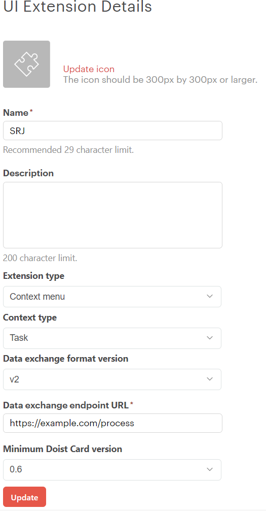
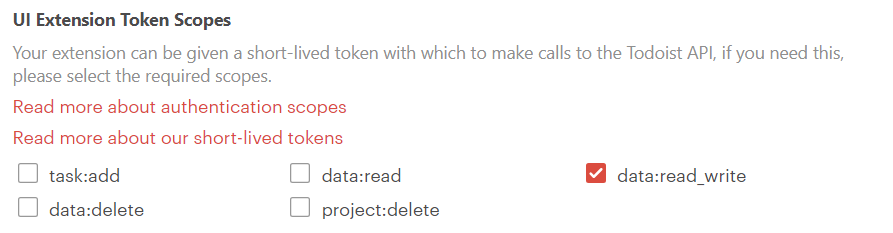

# Spaced Repetition Journal Todoist Extension

## Overview

This is an extension for the [Todoist](https://todoist.com) application.
It creates a very simple spaced repetition journal in Todoist, that can be useful for students that want to automate the spacing of their reviews.

The idea for this has been taken from [this video](https://youtu.be/Lt54CX9DmS4?si=U7_SDdFLWDqU6o--&t=2237).

## Usage

To use it you just need to create a task, click on the context menu and select this extension. Four subtasks will be created with spaced due dates (the following day, in 1 week, in 3 weeks and in 6 weeks).

For now the possibility to set custom intervals is not supported yet, but will likely be in the future.

## Getting started

You will need to create a Todoist app. To do so go to Todoist's [App Management Console](https://developer.todoist.com/appconsole.html) and select "Create a new app" and give it a name.
In the "UI Extensions" section, click "Add a new UI extension", give it a name, select "Context menu" as "Extension type", select "Task" as "Context type". In "Data exchange URL" text field you will put the domain name of the application (see next sections on how to do that) and add `/process` at the end of it.



Then back in the application menu, in the "UI Extensions" section make sure you have the checkbox with `data:read_write` checked. This makes Todoist send a short-lived token, within the request to this application, that will be used for authentication.



You will need to assign as environment variable (named `TODOIST_VERIFICATION_TOKEN`) the string you find in section "App settings" in the "Verification token" textbox. The application needs this to verify that the request actually came from Todoist's servers.

### Running locally for development

First install the needed dependencies:
```
npm ci
```

Then run the application in development mode:
```
npm run dev
```

Then you will need to create a tunnel to expose it to the internet. You can use tools like ngrok, localtunnel or CloudflareTunnels.
For example in order to expose port 3000 to the internet with ngrok run:
```
ngrok http 3000
```

Paste the domain name of the tunnel in the UI extension settings, as explained above, followed by `/process`.

Create in the root of the project a `.env` file and put there the value of the variable `TODOIST_VERIFICATION_TOKEN` (explained above where to find it).

Now everything should be up and running! You can test it opening the context menu of a task and clicking on the extension name.

### Running with docker

You can build and deploy your version of the application with the project `Dockerfile` (currently no official image exist).

To build image run the following command in the project root:
```
docker build -t srj-todoist-extension .
```

Then run the image as container (remember to the correct value of the variable `TODOIST_VERIFICATION_TOKEN` (explained above where to find it)):
```
docker run -d -e TODOIST_VERIFICATION_TOKEN=<YOUR_TOKEN> -p 80:3000 --name spaced-repetition-journal srj-todoist-extension
```

If you are running this container locally you will still need to create a tunnel (as explained in [Running locally for development](#running-locally-for-development)).

Paste the domain name of the tunnel (or of your server if you deployed the container) in the UI extension settings, as explained above, followed by `/process`.

Now everything should be up and running! You can test it opening the context menu of a task and clicking on the extension name.

## Project structure

- `app.ts` - Contains the endpoints.
- `service/` - Contains services for requests to Todoist's APIs and for handling incoming requests.
- `utils/` - Contains utilities such as templates for bridges, interfaces or custom errors.
